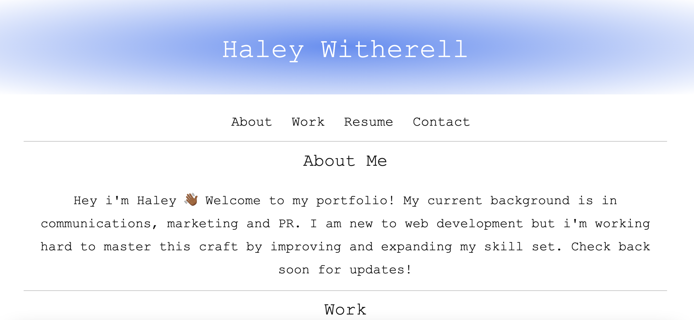

# Technologies used: 

HTML:
- I setup the overall layout of the webpage by creating dfferent sections within the html doc
- I created the nav bar headings which will eventually link to other pages
I insetred images that are displayed on the webpage
- I linked my LinkedIN and Github at the bottom of the page under contact info

CSS:
- The CSS stles eveything in the webpage
- I used CSS to layout everything in the header, including my name and the nav bar items 
- I used the gradient feature to set the background for the header and footer
- CSS adjusted fonts, line spacing, overall page spacing, colors 
- I used flex box to center the images on the page 

# Apperance 

# Known Bugs
- There are no known bugs. 

# Deployed Link 
https://haleywitherell.github.io/Portfolio-/